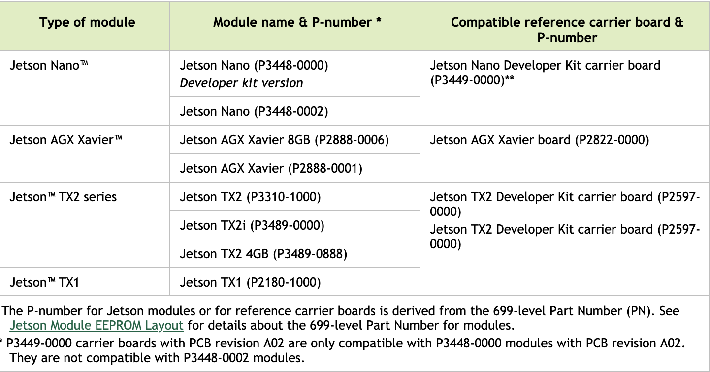

# SSRL TX2i Yocto

## Table of Contents
1. [List of Useful References](#list-of-useful-references)
2. [About Yocto](#about-yocto)
3. [Setting up Environment](#setting-up-environment)
4. [Build Configurations](#build-configurations)
5. [First TX2/TX2i Build](#first-tx2/tx2i-build)
6. [Flashing the TX2/TX2i](#flashing-the-tx2/tx2i)
7. [meta-ssrl-tx2i](#meta-ssrl-tx2i)
8. [Useful Commands](#useful-commands)

## List of Useful References
- https://github.com/madisongh/meta-tegra/tree/zeus-l4t-r32.3.1
- https://github.com/madisongh/meta-tegra/wiki/Flashing-the-Jetson-Dev-Kit
- https://www.konsulko.com/building-a-custom-linux-distribution-for-nvidia-cuda-enabled-embedded-devices/
- https://docs.nvidia.com/jetson/archives/l4t-archived/l4t-3231/index.html#page/Tegra%2520Linux%2520Driver%2520Package%2520Development%2520Guide%2Fquick_start.html%23
- https://docs.nvidia.com/jetson/l4t/index.html

- https://www.yoctoproject.org/docs/transitioning-to-a-custom-environment/
- https://www.yoctoproject.org/docs/3.0/ref-manual/ref-manual.html
- https://www.yoctoproject.org/docs/3.0/dev-manual/dev-manual.html
- https://www.yoctoproject.org/docs/1.0/poky-ref-manual/poky-ref-manual.html
- https://www.yoctoproject.org/docs/2.1/bitbake-user-manual/bitbake-user-manual.html
- https://www.yoctoproject.org/docs/3.0/kernel-dev/kernel-dev.html
- https://www.jetsonhacks.com/2017/03/24/serial-console-nvidia-jetson-tx2/

## About Yocto

## Setting up Environment
This section may be skipped if you are using the SSRL build server.
It is recommended to use Ubuntu 18.04 LTS for all Yocto builds.
The SSRL build server currently runs this version of linux.
If you plan on building on your own machine, be aware that Yocto builds from scratch can take up a LOT of cpu time and drive space.

Required Installations:
```
sudo apt install gawk wget git-core diffstat unzip texinfo gcc-multilib \
     build-essential chrpath socat libsdl1.2-dev xterm
```

Cloning Git Repositories:
```
git clone git://git.yoctoproject.org/poky -b zeus
cd poky
git clone https://github.com/madisongh/meta-tegra.git -b zeus-l4t-r32.3.1
git clone TODO -b zeus-l4t-r32.3.1
```

Downloading Nvidia SDK Manager:

This will require to make an NVIDIA developer account.
Once created download the NVIDIA SDK Manager program and download the required sdk's for your device with version 4.3 of the Jetpack.
A command line version of this is available.
Information for this can be found at https://developer.nvidia.com/nvidia-sdk-manager.

*Note*: The cli version will require you to X-forward if you are ssh'ing into a build server to install the sdk's.
If using Ubuntu 18.04 LTS, you may need to install libraries/packages from the ubuntu universe repository as well.

## Build Configurations
Once Poky and all the required meta layers are cloned, you must source the bash environment provided with Poky.
This will put useful tools (most importantly bitbake) in your path that will be used to build the TX2i image.
This operation must be done every time you logout/start a new terminal.
From the home folder on SSRL (or the parent folder of poky on your own machine):
```
source poky/oe-init-build-env tx2i-build
```
This will put you in the tx2i-build folder, and create it if you have not already done this before.
This folder will eventually contain all downloaded files, build files, and images.
You will find that there is only a conf folder that contains the `bblayers.conf` and `local.conf` configuration files.

`bblayers.conf`: Contains directory paths for all the required meta layers for a build

`local.conf`: Contains all user defined configurations for the build target.

* Reference https://www.yoctoproject.org/docs/3.0/ref-manual/ref-manual.html#ref-structure for more information on the directory structure of the Yocto project.

Your bblayers variable in the bblayers.conf should look like the following:
Correct the directory path for *USER* and if you have a differing directory structure.
```
BBLAYERS ?= " \
  /home/ssrl/poky/meta \
  /home/ssrl/poky/meta-poky \
  /home/ssrl/poky/meta-yocto-bsp \
  /home/ssrl/poky/meta-tegra \
  /home/ssrl/poky/meta-tegra/contrib \
  /home/ssrl/poky/meta-ssrl-tx2i \
  "
```

Append the following to your local.conf file:
```
#
# TX2/TX2i Configuration
#

MACHINE = "jetson-tx2i"
# For development testing on the tx2
# MACHINE = "jetson-tx2"

GCCVERSION = "7.%"
require contrib/conf/include/gcc-compat.conf
CUDA_VERSION = "10.0"
LICENSE_FLAGS_WHITELIST = "commercial"
IMAGE_CLASSES += "image_types_tegra"
IMAGE_FSTYPES = "tegraflash"
NVIDIA_DEVNET_MIRROR = "file:///home/ssrl/Downloads/nvidia/sdkm_downloads"

# Used for CUDA testing, comment out in final deployment image
IMAGE_INSTALL_append = "cuda-samples"
```
There are a few options listed that will make development testing easier, they should be removed in the final build version.

Your final directory structure should look like the following:
```
~/poky/
    meta/
    meta-tegra/
    meta-ssrl-tx2i/
    ...

~/tx2i-build/
    build/
        conf/
            local.conf
            bblayers.conf
    ...
```

## First TX2/TX2i Build
A minimal build for the TX2 can be run with the following command from within the tx2i-build directory:
```
bitbake core-image-minimal
```
*Note*: The initial build may take a LOT of time to execute, go grab a cup of coffee in the meantime. Suspsequent builds should be much quicker depending on what is changed and if the tmp, cache, downloads, and sstate-cache directories have not been deleted.

*Note*: If you are attempting to build for a Jetson Nano, this README does not have all steps necessary to successfully build. Please reference the `meta-tegra` repository for more information on Jetson Nano.

## Flashing the TX2/TX2i
All completed images are saved to the `tx2i-build/tmp/deploy/images` directory.
meta-tegra includes an option to build an image that comes with a script to flash the TX2/TX2i.
This was included in the `local.conf` file with `IMAGE_CLASSES += "image_types_tegra"` and `IMAGE_FSTYPES = "tegraflash"`.
There will be a file named something similar to `core-image-minimal-jetson-tx2i.tegraflash.zip`.
1. Download the zip file to your host machine that you will flash the TX2/TX2i from and unzip.
2. Connect the TX2/TX2i to your host machine with a micro-usb cable.
    *Note*: If your computer does not detect the TX2/TX2i at step 4 it could be because a cable without data lines was used.
3. From a cold boot, hold down the recovery button and keep it held.
    Press the power button.
    Then, press the reset button (there should be a quick flash of the dev board lights).
    Finally, release the recovery button after 2 seconds.
4. If the TX2/TX2i is succesfully put into recovery mode, you should detect an `NVIDIA` device with the lsusb command.
5. To flash the device run the following command from within the unzipped directory:
```
sudo ./doflash.sh
```

The TX2/TX2i should automatically reboot with the new image.
Login with root and no password.

To verify that CUDA is working enter the following commands.
```
cd /usr/bin/cuda-samples
./deviceQuery
./UnifiedMemoryStreams
```

## meta-ssrl-tx2i
This repository contains the SSRL meta layer with configurations/recipes that are specific to the SSRL build for the TX2/TX2i.

#### TODO
* Packages/Dependencies:
  * Have dev version of build that includes OpenSSH
  * nvcc
  * python3 (Add a specific version)
  * remove unneeded packages
* Ram Filesystem
* CORGI Interface
* Find more stuff that needs to be done

## Useful Commands
List of all packages for image target:
```
bitbake -g <image> && cat pn-buildlist | grep -ve "native" | sort | uniq
```

List all package and their versions for image target:
```
cat tmp/deploy/images/*/core-image-base-*.manifest
```

List all layers for image target:
```
bitbake-layers show-layers
```